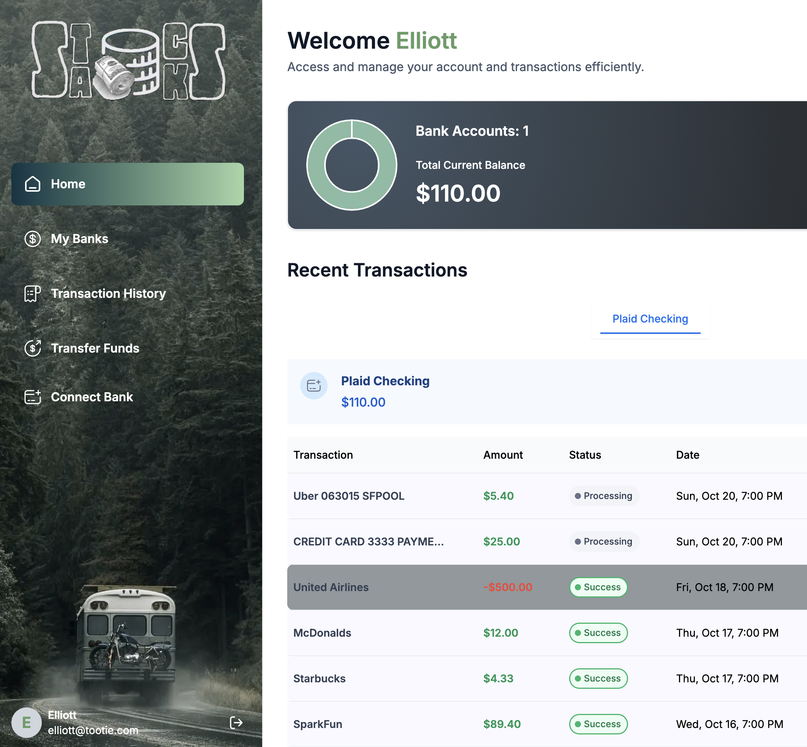

<div style="display: flex; align-items: center; justify-content: center">
  
  <!-- <h3>Stacks</h3> -->
</div>

[Stacks](https://banking-app-drab-beta.vercel.app/) is a financial SaaS platform built with Next.js and Appwrite, designed to streamline personal finance management. Integrated with Plaid and Dwolla, Stacks enables the connection of multiple bank accounts, provides real-time transaction data, and facilitates seamless bank transfers. 

<small>This is a [Next.js](https://nextjs.org) project bootstrapped with [`create-next-app`](https://nextjs.org/docs/app/api-reference/cli/create-next-app).</small>



## Features

💲 Authentication: An ultra-secure SSR authentication with proper validations and authorization

💲 Connect Banks: Integrates with Plaid for multiple bank account linking

💲 Home Page: Shows general overview of user account with total balance from all connected banks, recent transactions, money spent on different categories, etc

💲 My Banks: Check the complete list of all connected banks with respective balances, account details

💲 Transaction History: Includes pagination and filtering options for viewing transaction history of different banks

💲 Real-time Updates: Reflects changes across all relevant pages upon connecting new bank accounts.

💲 Funds Transfer: Allows users to transfer funds using Dwolla to other accounts with required fields and recipient bank ID.

💲 Responsiveness: Ensures the application adapts seamlessly to various screen sizes and devices, providing a consistent user experience across desktop, tablet, and mobile platforms.

💲 Vercel:
A cloud platform for static sites and serverless functions, optimized for deploying Next.js applications. It offers fast global deployment and easy scalability, making it ideal for modern web projects.

## Technologies
⚙️ Next.js:
A React framework for building optimized web applications with features like server-side rendering, static site generation, and API routes, enhancing performance and scalability.

⚙️ React.js:
A JavaScript library for building user interfaces, especially single-page applications, by creating reusable UI components, making it efficient for developing dynamic, interactive web apps. 

⚙️ Appwrite: An open-source backend-as-a-service that provides ready-to-use APIs for handling authentication, databases, file storage, and other backend services, making it easier to build and manage apps.

⚙️ Plaid:
A financial technology platform that securely connects apps to users' bank accounts, enabling functionality like payments, account verification, and transaction tracking.

⚙️ Dwolla:
A payment platform that allows businesses to send and receive funds via the ACH (Automated Clearing House) network in the United States, enabling seamless bank transfers and payments.

⚙️ ShadCN:
A collection of pre-built, accessible UI components built with Tailwind CSS and Radix UI for React, making it easy to design modern, responsive interfaces quickly.

⚙️ Tailwind CSS:
A utility-first CSS framework that allows developers to build responsive and customizable designs quickly by using predefined classes directly in HTML.

## Set Up Environment Variables

Create a new file named `.env` in the root of your project and add the following content:

```env
#NEXT
NEXT_PUBLIC_SITE_URL=

#APPWRITE
NEXT_PUBLIC_APPWRITE_ENDPOINT=https://cloud.appwrite.io/v1
NEXT_PUBLIC_APPWRITE_PROJECT=
APPWRITE_DATABASE_ID=
APPWRITE_USER_COLLECTION_ID=
APPWRITE_BANK_COLLECTION_ID=
APPWRITE_TRANSACTION_COLLECTION_ID=
APPWRITE_SECRET=

#PLAID
PLAID_CLIENT_ID=
PLAID_SECRET=
PLAID_ENV=
PLAID_PRODUCTS=
PLAID_COUNTRY_CODES=

#DWOLLA
DWOLLA_KEY=
DWOLLA_SECRET=
DWOLLA_BASE_URL=https://api-sandbox.dwolla.com
DWOLLA_ENV=sandbox
```

## Getting Started

```bash
  npm run dev
```
Open [http://localhost:3000](http://localhost:3000) in your browser to view the project.


## Learn More

To learn more about Next.js, take a look at the following resources:

- [Next.js Documentation](https://nextjs.org/docs) - learn about Next.js features and API.
- [Learn Next.js](https://nextjs.org/learn) - an interactive Next.js tutorial.

You can check out [the Next.js GitHub repository](https://github.com/vercel/next.js) - your feedback and contributions are welcome!
